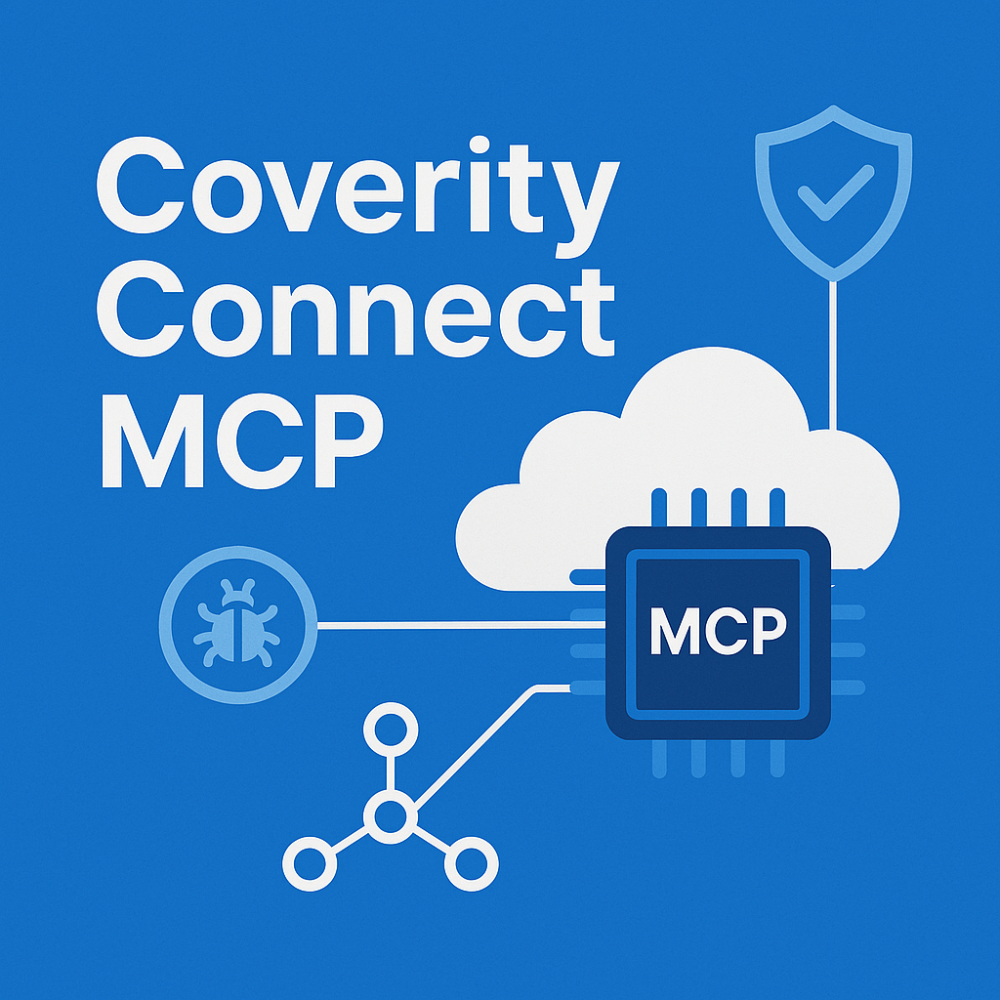

# Coverity Connect MCP Server



<!-- [](https://badge.fury.io/py/coverity-connect-mcp) -->
<!-- [](https://pypi.org/project/coverity-connect-mcp/) -->
[](https://opensource.org/licenses/MIT)
[](https://github.com/keides2/coverity-connect-mcp/actions)
[](https://codecov.io/gh/keides2/coverity-connect-mcp)

[English](README.md) | **日本語**

AIアシスタント（Claude Desktopなど）と**Black Duck Coverity Connect**静的解析プラットフォームを**シームレスに統合**する**Model Context Protocol (MCP) サーバー**です。

自然言語コマンドとAI駆動の自動解析により、Coverityワークフローを革新的に変革します。

## 🚀 機能

### 🔍 **包括的なCoverity統合**
- **プロジェクト管理**: Coverityプロジェクトとストリームの一覧・探索
- **欠陥解析**: 高度な欠陥検索とインテリジェントフィルタリング、詳細分析
- **ユーザー管理**: 完全なユーザー管理、ロール管理、アクセス制御
- **セキュリティ重視**: 専門的なセキュリティ脆弱性検出・分析
- **CI/CD自動化**: 継続的品質監視のための自動パイプライン統合
- **品質レポート**: エグゼクティブレベルの品質ダッシュボードと傾向分析

### 🤖 **AI駆動の解析**
- **自然言語クエリ**: 「プロジェクトXの重要なセキュリティ問題を表示して」または「管理者権限を持つユーザーを一覧表示して」
- **インテリジェントフィルタリング**: 高影響度欠陥の自動優先順位付けとユーザーアクセス管理
- **コンテキスト推奨**: AI駆動の修正提案とセキュリティ監査インサイト
- **傾向分析**: 履歴データ分析、品質メトリクス、ユーザーアクティビティパターン

### 🛠️ **エンタープライズ対応**
- **SOAP API統合**: Coverity Connect Webサービスの完全サポート
- **認証**: 安全な認証キーベース認証
- **プロキシサポート**: 企業ネットワークとプロキシ設定
- **マルチプラットフォーム**: Windows、macOS、Linux対応
- **Docker対応**: エンタープライズ環境向けコンテナ化デプロイメント

## 📦 インストール

### 🎯 **Claude Desktopとの統合（推奨）**

Claude Desktopユーザーは、最新リリースからDXTパッケージをダウンロードしてください：

1. **DXTパッケージのダウンロード**:
   - [Releases](https://github.com/keides2/coverity-connect-mcp/releases)にアクセス
   - 最新リリースから`coverity-connect-mcp-1.0.0.dxt`をダウンロード

2. **Claude Desktopにインストール**:
   - `.dxt`ファイルをClaude Desktopにドラッグ＆ドロップ
   - 環境変数を設定（設定セクションを参照）

### 🐍 **Pythonパッケージインストール**

#### GitHubから直接インストール
```bash
# GitHubから直接インストール（推奨）
pip install git+https://github.com/keides2/coverity-connect-mcp.git
```

#### ソースからのインストール

```bash
# ソースからクローン＆インストール
git clone https://github.com/keides2/coverity-connect-mcp.git
cd coverity-connect-mcp
pip install -e .
```

## 🔧 開発用インストール

開発目的の場合：

```bash
git clone https://github.com/keides2/coverity-connect-mcp.git
cd coverity-connect-mcp

# 仮想環境を作成
python -m venv venv
source venv/bin/activate  # Windows: venv\Scripts\activate

# 開発依存関係と一緒にインストール
pip install -e ".[dev]"
```

## 🚀 今後のインストール方法

以下のインストール方法は今後のリリースで計画されています：

### PyPIからのインストール（計画中）

```bash
pip install coverity-connect-mcp
```

### Dockerでのインストール（計画中）

```bash
docker pull keides2/coverity-connect-mcp:latest
```

## ⚙️ 設定

### 1. 環境変数
`.env`ファイルを作成するか、環境変数を設定してください：

```bash
# 必須 - Coverity Connect認証
export COVAUTHUSER="coverityユーザー名"
export COVAUTHKEY="coverity認証キー"

# 必須 - Coverityサーバー
export COVERITY_HOST="your-coverity-server.com"
export COVERITY_PORT="443"
export COVERITY_SSL="True"

# オプション - ローカルワークスペース
export COVERITY_BASE_DIR="/path/to/coverity/workspace"

# オプション - 企業プロキシ（必要な場合）
export PROXY_HOST="proxy-server.com"
export PROXY_PORT="3128"
export PROXY_USER="プロキシユーザー名"  # 認証が必要な場合
export PROXY_PASS="プロキシパスワード"  # 認証が必要な場合
```

### 2. Claude Desktop統合
`claude_desktop_config.json`に追加：

```json
{
  "mcpServers": {
    "coverity-connect": {
      "command": "coverity-mcp-server",
      "env": {
        "COVAUTHUSER": "${COVAUTHUSER}",
        "COVAUTHKEY": "${COVAUTHKEY}",
        "COVERITY_HOST": "your-coverity-server.com"
      }
    }
  }
}
```

### 3. Docker設定

> **注意**: Dockerイメージはまだ公開されていないため、ローカルでビルドできます：

```yaml
# docker-compose.yml
version: '3.8'
services:
  coverity-mcp:
    build: .  # ローカルソースからビルド
    # 将来: image: keides2/coverity-connect-mcp:latest
    environment:
      - COVAUTHUSER=${COVAUTHUSER}
      - COVAUTHKEY=${COVAUTHKEY}
      - COVERITY_HOST=${COVERITY_HOST}
      # オプション：プロキシ設定
      - PROXY_HOST=${PROXY_HOST}
      - PROXY_PORT=${PROXY_PORT}
    ports:
      - "8000:8000"
```

## 🎯 使用例

### 基本的なプロジェクト解析
```
すべてのCoverityプロジェクトとその現在のステータスを表示してください
```

### セキュリティ重視の解析
```
プロジェクト「MyWebApp」の最新スナップショットを解析し、高重要度のセキュリティ脆弱性に焦点を当ててください。具体的な修正推奨事項を提供してください。
```

### 品質レポート
```
プロジェクト「MyProject」の過去30日間の傾向を含む包括的な品質レポートを生成してください
```

### CI/CD統合
```
グループ「web-team」、プロジェクト「frontend」、ブランチ「main」のCoverity自動解析を実行し、コミットメッセージ「セキュリティ修正」で実行してください
```

### 高度なフィルタリング
```
プロジェクト「EmbeddedSystem」のすべてのCERT-C違反で影響レベル「High」のものを表示し、修正のためのコード例を提供してください
```

### ユーザー管理・セキュリティ監査
```
管理者権限を持つすべてのユーザーを一覧表示し、最終ログイン時刻も表示してください
```

### ロールベースアクセス制御
```
ユーザー「developer1」の権限とロール割り当てを表示し、セキュリティ上の懸念を特定してください
```

## 🛠️ 利用可能なツール

| ツール | 説明 | 使用例 |
|------|-------------|---------------|
| `search_defects` | フィルタリング機能付き高度欠陥検索 | 高重要度セキュリティ脆弱性の発見 |
| `get_defect_details` | 特定欠陥の詳細情報取得 | 欠陥イベントと修正手順の分析 |
| `list_projects` | アクセス可能なCoverityプロジェクト一覧を取得 | プロジェクト棚卸しとアクセス確認 |
| `list_streams` | 特定プロジェクトのストリームを取得 | ストリームベース解析計画 |
| `get_project_summary` | 包括的プロジェクト解析取得 | エグゼクティブプロジェクトヘルスレポート |
| `list_users` | 🆕 Coverity Connectの全ユーザー一覧取得 | ユーザー棚卸しとアクセス管理 |
| `get_user_details` | 🆕 ユーザーの詳細情報取得 | ユーザープロファイルとアカウント状態確認 |
| `get_user_roles` | 🆕 ユーザーロール・権限情報取得 | セキュリティ監査とアクセス制御レビュー |

## 📚 ドキュメント

### 🚀 クイックスタート

- **[本番環境セットアップガイド](docs/GETTING_STARTED.md)** - 📋 本番環境での完全な立ち上げ手順

### 詳細ドキュメント

- **[インストールガイド](docs/ja/installation.md)** - 詳細なセットアップ手順
- **[設定リファレンス](docs/ja/configuration.md)** - 完全な設定オプション
- **[APIリファレンス](docs/ja/api.md)** - 包括的なAPIドキュメント
- **[使用例](docs/usage.md)** - 実際の使用シナリオ *(作成中)*
- **[トラブルシューティング](docs/troubleshooting.md)** - よくある問題と解決方法 *(作成中)*

> 📝 **注意**: 詳細なドキュメントは、実際の使用例とコミュニティフィードバックを基に作成中です。メインREADMEには、すぐに始めるための完全なセットアップと使用情報が提供されています。

## 🧪 テスト

```bash
# 単体テスト実行
pytest tests/

# 統合テスト実行
pytest tests/ -m integration

# カバレッジ付きテスト実行
pytest --cov=coverity_mcp_server tests/

# Dockerでテスト
docker-compose -f docker-compose.test.yml up --abort-on-container-exit
```

## 🤝 貢献

貢献を歓迎します！詳細は[貢献ガイド](CONTRIBUTING.md)をご覧ください。

### 開発環境セットアップ
```bash
git clone https://github.com/keides2/coverity-connect-mcp.git
cd coverity-connect-mcp
python -m venv venv
source venv/bin/activate  # Windows: venv\Scripts\activate
pip install -e ".[dev]"
pre-commit install
```

### 変更の提出
1. リポジトリをフォーク
2. 機能ブランチを作成 (`git checkout -b feature/amazing-feature`)
3. 変更をコミット (`git commit -m 'Add amazing feature'`)
4. ブランチにプッシュ (`git push origin feature/amazing-feature`)
5. プルリクエストを開く

## 📄 ライセンス

このプロジェクトはMITライセンスの下でライセンスされています - 詳細は[LICENSE](LICENSE)ファイルをご覧ください。

## 🙏 謝辞

- **Black Duck Coverity** - 静的解析プラットフォームの提供
- **Anthropic** - Model Context ProtocolとClaude AIの提供
- **オープンソースコミュニティ** - 基盤となるライブラリとツールの提供

## 📞 サポート

- **GitHub Issues**: [バグ報告や機能要求](https://github.com/keides2/coverity-connect-mcp/issues)
- **Discussions**: [コミュニティサポートと質問](https://github.com/keides2/coverity-connect-mcp/discussions)
- **セキュリティ問題**: [セキュリティポリシー](SECURITY.md)をご確認ください

## 🗺️ ロードマップ

- [x] **v1.0**: ユーザー管理機能を含む完全なMCP実装 ✨
- [ ] **v1.1**: 高度なフィルタリング、カスタムビュー、分析ダッシュボード
- [ ] **v1.2**: マルチテナントサポートと強化されたユーザー管理
- [ ] **v1.3**: GraphQL APIとリアルタイム通知
- [ ] **v1.4**: 機械学習による欠陥優先順位付けとリスク評価
- [ ] **v2.0**: プラグインアーキテクチャとサードパーティ統合

## 🌸 日本での活用

### **企業環境での実用性**
- **大手SIer**: エンタープライズ開発での品質管理
- **製造業**: 組み込みソフトウェアのセキュリティ強化
- **金融機関**: 高セキュリティ要件システムの品質保証
- **自動車業界**: 車載ソフトウェアの安全性確保

### **日本語サポート**
- 日本語での自然言語クエリ対応
- 日本の企業プロキシ環境に最適化
- 日本語ドキュメントとサポート

---

**❤️ ソフトウェアセキュリティコミュニティのために作られました**

*AIの力で静的解析ワークフローを変革しましょう*

## 💫 日本語での使用例

### セキュリティ解析
```
「WebアプリケーションプロジェクトでSQLインジェクションの脆弱性を確認して、修正方法も教えて」
```

### 品質管理
```
「今月のコード品質スコアと先月との比較、改善すべき点をレポートして」
```

### ユーザー管理・アクセス制御 🆕
```
「開発チームのメンバー一覧とそれぞれのアクセス権限を表示して」
```

### セキュリティ監査 🆕
```
「管理者権限を持つユーザーの最終ログインをチェックして、不審なアクセスがないか確認して」
```

### チーム管理
```
「開発チーム別の指摘件数と修正率を集計して、パフォーマンスを評価して」
```
