# Coverity Connect MCP Server - クラス設計図・UMLダイアグラム

**Version**: 1.0.0  
**作成日**: 2025年7月21日  
**更新日**: 2025年7月21日

## 📋 概要

本ドキュメントでは、Coverity Connect MCP Serverの主要クラスとコンポーネントの設計をUMLダイアグラムで表現します。

## 🏗️ 1. クラス図 (Class Diagram)

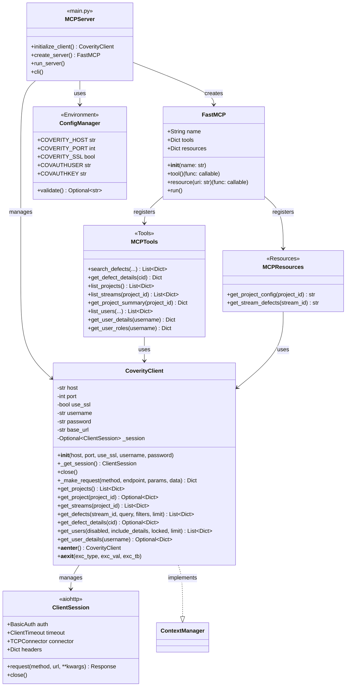

## 🔄 2. コンポーネント図 (Component Diagram)

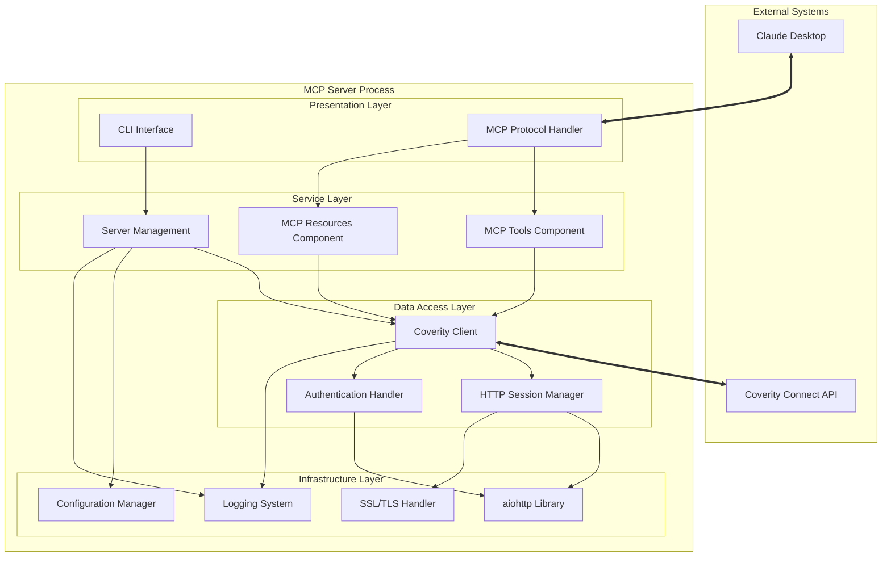

## 📊 3. パッケージ図 (Package Diagram)

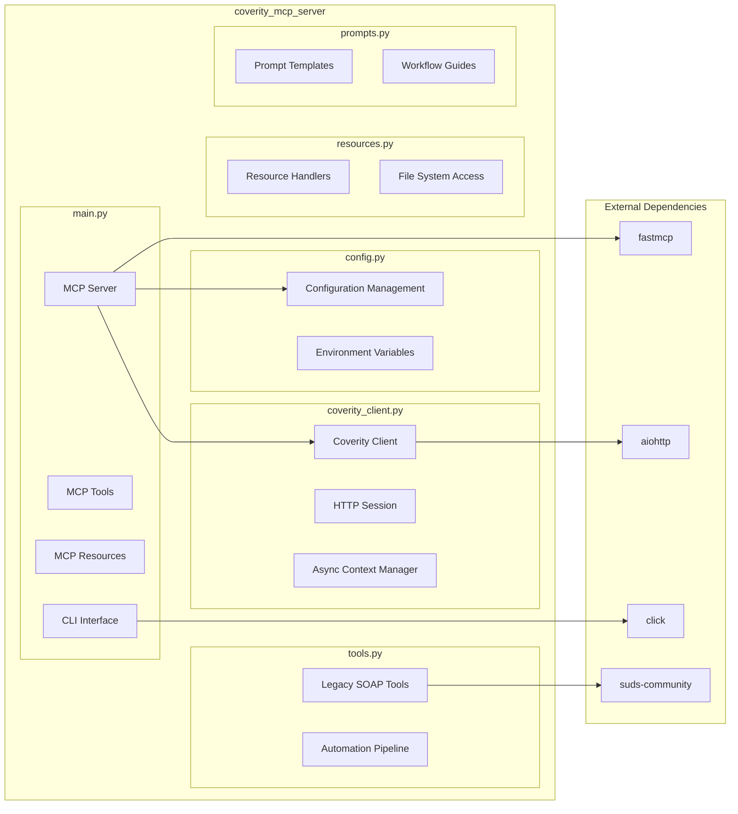

## 🔄 4. アクティビティ図 (Activity Diagram)

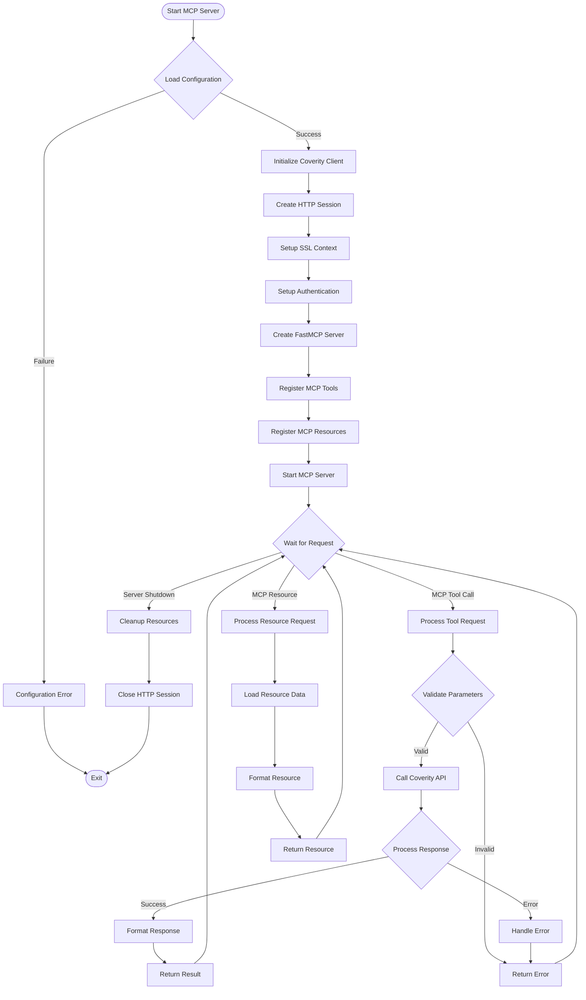

## 🏛️ 5. デプロイメント図 (Deployment Diagram)

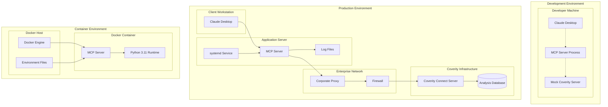

## 📈 6. 状態図 (State Diagram)

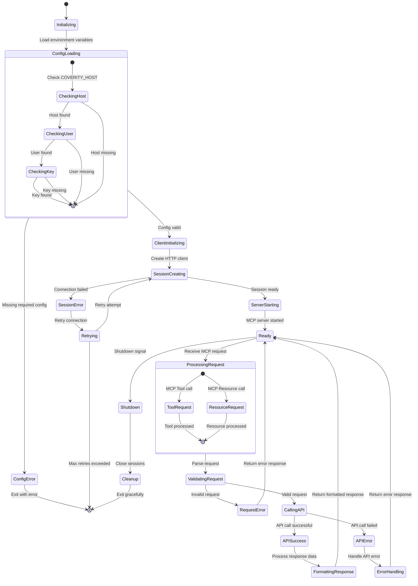

## 🔗 7. シーケンス図 - オブジェクト間インタラクション

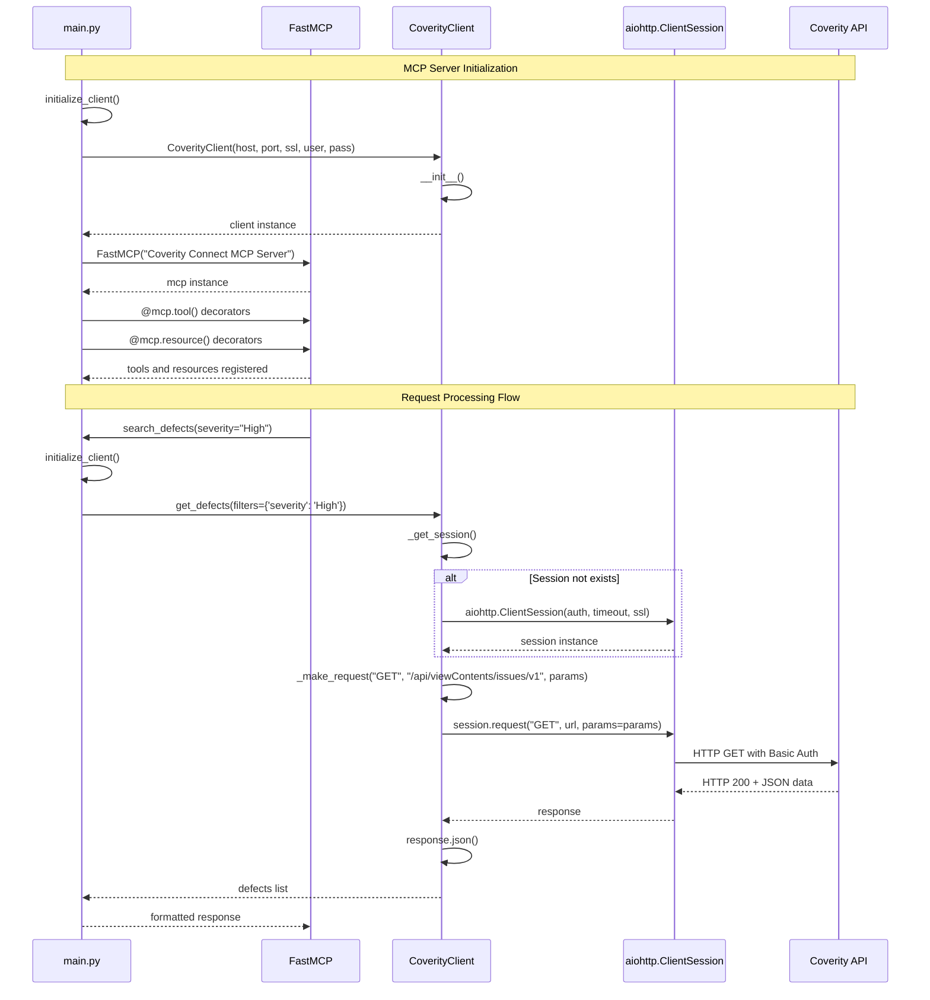

## 🔧 8. オブジェクトライフサイクル図

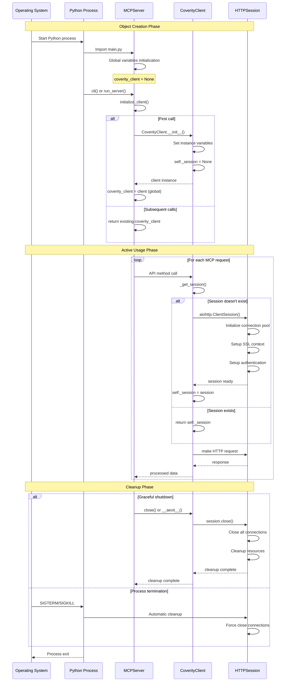

## 🎯 9. 設計パターン適用図

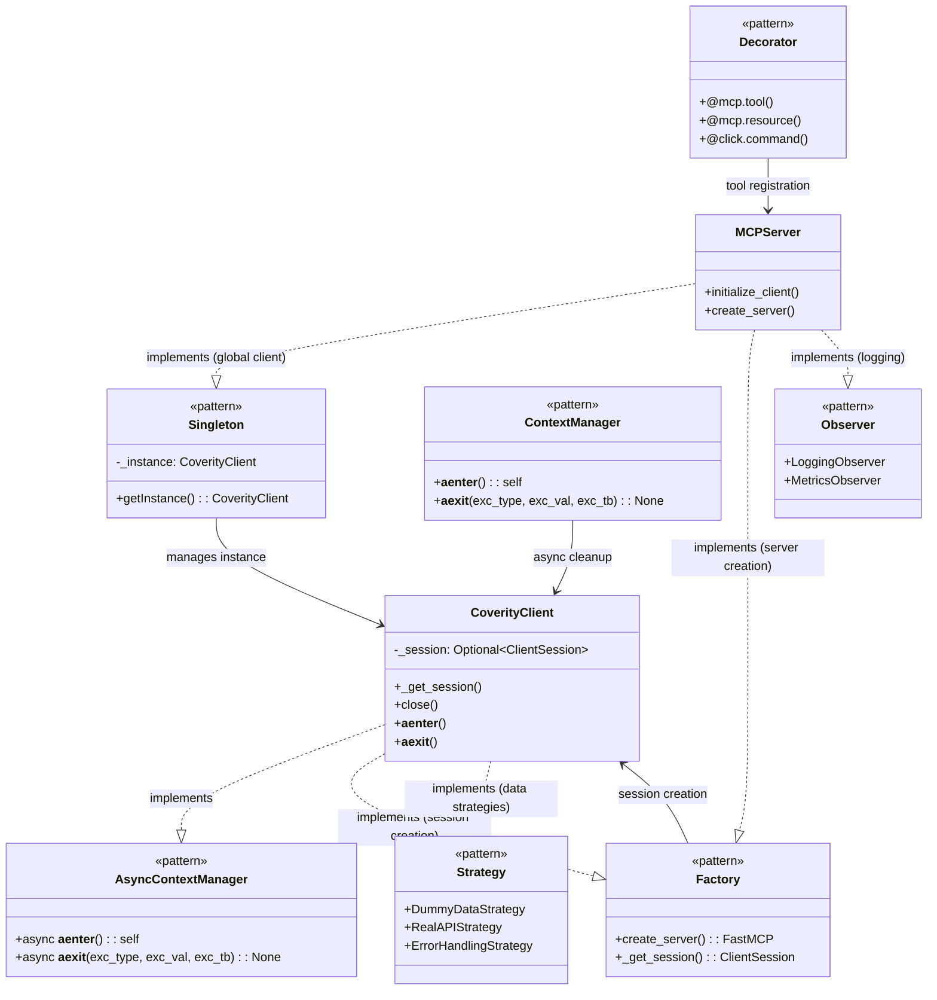

## 🔄 10. データフロー図

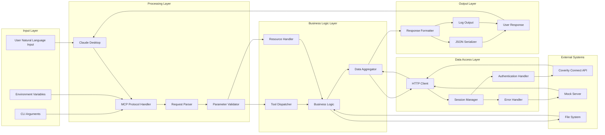

## 📊 11. メトリクス・監視ポイント図

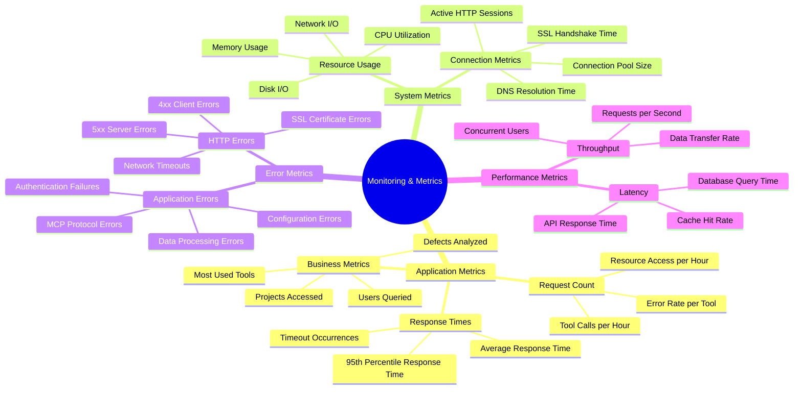

## 🔐 12. セキュリティアーキテクチャ図

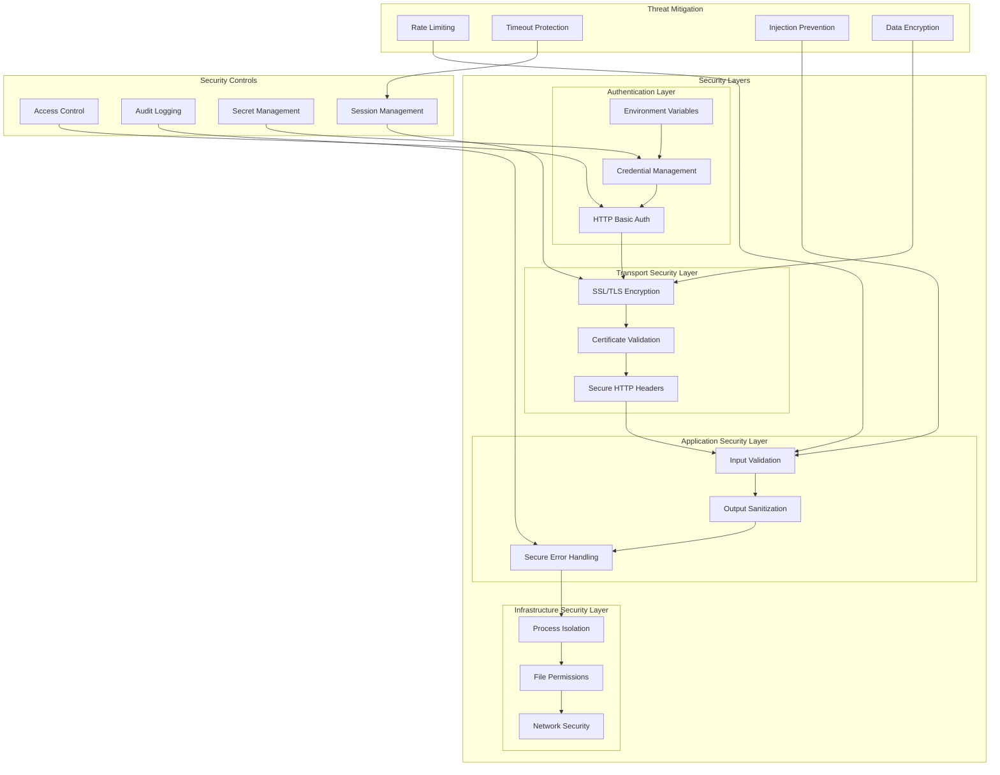

---

**このクラス設計図・UMLダイアグラム集は、Coverity Connect MCP Serverの設計構造を多角的に表現しています。クラス関係、コンポーネント構成、処理フロー、デプロイメント構成、セキュリティアーキテクチャなど、システムの全体像を理解するための包括的な視覚化を提供しています。**