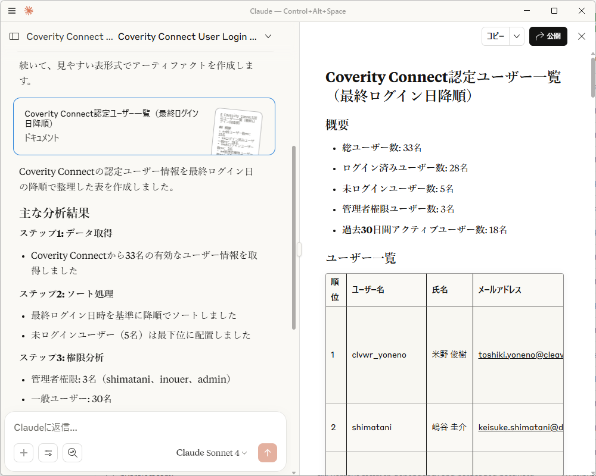

# Coverity Connect 認定ユーザー最終ログイン日レポート（降順）

Coverity Connect MCP Server の活用例として、AIアシスタント Claude Desktop と連携し、認定ユーザーの最終ログイン日を降順で一覧化したレポートを自動生成する様子を示します。

## list_users エンドポイントの実行

```prompt
現在のCoverity Connect 認定ユーザーを最終ログイン日の降順で作表してください
```


## コード自動生成による表作成

取得したユーザー情報を分析し、最終ログイン日でソートし、表形式でまとめています。


## 完成した一覧表

アーティファクトというドキュメントを生成。生成されたドキュメントは、テキストコピーやMarkdown・PDF形式で保存可能です。



## 分析結レポート

さらに、取得データをもとに簡易的な分析も実施しています。


以下は生成されたMarkdown形式のレポートです。

---
# Coverity Connect認定ユーザー一覧（最終ログイン日降順）

## 概要
- **総ユーザー数**: 33名
- **ログイン済みユーザー数**: 28名
- **未ログインユーザー数**: 5名
- **管理者権限ユーザー数**: 3名
- **過去30日間アクティブユーザー数**: 18名

## ユーザー一覧

| 順位 | ユーザー名 | 氏名 | メールアドレス | 最終ログイン | 権限 |
|------|------------|------|----------------|--------------|------|
| 1 | clvwr_yoneno | 米野 俊樹 | toshiki.yoneno@cleaveware.com | 2025/07/31 09:41 | 一般ユーザー |
| 2 | shimatani | 嶋谷 圭介 | keisuke.shimatani@daikin.co.jp | 2025/07/31 09:37 | **管理者** |
| 3 | shinh | 申 秀雄 | hideo.shin@daikin.co.jp | 2025/07/31 09:22 | 一般ユーザー |
| 4 | zipc_yashima | 八嶋 玲 | ryo.yashima.bp@zipc0.onmicrosoft.com | 2025/07/30 18:37 | 一般ユーザー |
| 5 | zipc_sato | 佐藤 晃一 | koichi.sato.bp@zipc0.onmicrosoft.com | 2025/07/30 18:32 | 一般ユーザー |
| 6 | matsukit | 松木 徹哉 | tetsuya.matsuki@daikin.co.jp | 2025/07/30 14:52 | 一般ユーザー |
| 7 | fujiiyuu | 藤井 優宇 | yuu.fujii@daikin.co.jp | 2025/07/30 14:20 | 一般ユーザー |
| 8 | inouer | 井上 良二 | ryouji.inoue@daikin.co.jp | 2025/07/30 11:07 | **管理者** |
| 9 | core_kimura | 木村 純 | jun-kimura@core.co.jp | 2025/07/30 09:14 | 一般ユーザー |
| 10 | zipc_morishima | 森嶋 晃介 | kousuke.morishima.bp@zipc0.onmicrosoft.com | 2025/07/29 19:15 | 一般ユーザー |
| 11 | zipc_morimoto | 森本 寛 | hiroshi.morimoto.bp@zipc0.onmicrosoft.com | 2025/07/29 18:45 | 一般ユーザー |
| 12 | zipc_yanagisawa | 柳澤 伸紘 | nobu.yanagisawa.bp@zipc0.onmicrosoft.com | 2025/07/29 18:30 | 一般ユーザー |
| 13 | scnet_yamamoto | 山本 啓太 | keita.yamamoto@grp.daikin.co.jp | 2025/07/29 16:04 | 一般ユーザー |
| 14 | zipc_kina | 喜納 悌之 | tomoyuki.kina@zipc0.onmicrosoft.com | 2025/07/28 18:29 | 一般ユーザー |
| 15 | zipc_ushijima | 牛島 明 | akira.ushijima.bp@zipc0.onmicrosoft.com | 2025/07/25 17:02 | 一般ユーザー |
| 16 | core_kawamoto | 河本 旭 | a-kawamoto@core.co.jp | 2025/07/18 18:46 | 一般ユーザー |
| 17 | witool | Sutjarit Witool | witool@dit.daikin.co.jp | 2025/07/16 09:55 | 一般ユーザー |
| 18 | admin | User Admin | keisuke.shimatani@daikin.co.jp | 2025/07/14 11:46 | **管理者** |
| 19 | dit_kuroda | 黑田 直樹 | kuroda.naoki@ditgroup.jp | 2025/06/30 13:52 | 一般ユーザー |
| 20 | zipc_zhang | 張 小亮 | xiaoliang.zhang@zipc0.onmicrosoft.com | 2025/06/20 15:01 | 一般ユーザー |
| 21 | mse_kurokawa | 黒川 優太郎 | kurokawa.yutaro@nttd-mse.com | 2025/06/18 14:49 | 一般ユーザー |
| 22 | zipc_inoue | 井上 佳大 | keita.inoue.bp@zipc0.onmicrosoft.com | 2025/06/10 09:11 | 一般ユーザー |
| 23 | nakasej | 中瀬 絢哉 | junya.nakase@daikin.co.jp | 2025/05/29 13:11 | 一般ユーザー |
| 24 | dit_nishimoto | 西本 祥 | nishimoto.sho@ditgroup.jp | 2025/05/26 17:44 | 一般ユーザー |
| 25 | mse_kitajima | 北島 貴司 | kitajima.takashi@nttd-mse.com | 2025/05/08 09:09 | 一般ユーザー |
| 26 | minourar | 三ノ浦 諒 | ryou.minoura@daikin.co.jp | 2025/04/21 15:34 | 一般ユーザー |
| 27 | yamadataka | 山田 貴博 | takahiro.yamada@daikin.co.jp | 2024/12/11 13:26 | 一般ユーザー |
| 28 | andouka | 安藤 和陽 | kazuaki.andou@daikin.co.jp | 2024/10/16 16:45 | 一般ユーザー |
| 29 | nabeshima | 鍋島 雅貴 | masataka.nabeshima@daikin.co.jp | **未ログイン** | 一般ユーザー |
| 30 | nakamurahirof | 中村 洋文 | hirofumi.nakamura@daikin.co.jp | **未ログイン** | 一般ユーザー |
| 31 | reporter | User Reporter | （設定なし） | **未ログイン** | 一般ユーザー |
| 32 | x.wang | 汪 星伊 | x.wang@daikin.co.jp | **未ログイン** | 一般ユーザー |
| 33 | yamadamo | 山田 基晴 | motoharu.yamada@daikin.co.jp | **未ログイン** | 一般ユーザー |

## 組織別分類

### ダイキン工業
- 嶋谷 圭介（管理者）
- 井上 良二（管理者）
- 申 秀雄
- 藤井 優宇
- 松木 徹哉
- 中瀬 絢哉
- 三ノ浦 諒
- 山田 貴博
- 安藤 和陽
- 鍋島 雅貴（未ログイン）
- 中村 洋文（未ログイン）
- 汪 星伊（未ログイン）
- 山田 基晴（未ログイン）

### ZIPC
- 八嶋 玲
- 佐藤 晃一
- 森嶋 晃介
- 森本 寛
- 柳澤 伸紘
- 喜納 悌之
- 牛島 明
- 張 小亮
- 井上 佳大

### その他パートナー企業
- 米野 俊樹（Cleaveware）
- 木村 純（CORE）
- 河本 旭（CORE）
- 黑田 直樹（DIT）
- 西本 祥（DIT）
- 北島 貴司（NTT-MSE）
- 黒川 優太郎（NTT-MSE）
- Sutjarit Witool（DIT）
- 山本 啓太（SCNET）

## 分析結果

### アクティビティ状況
1. **高活動ユーザー**: 過去7日以内にログインしたユーザーが13名
2. **中活動ユーザー**: 過去30日以内にログインしたユーザーが18名
3. **低活動ユーザー**: 30日以上ログインがないユーザーが10名
4. **未使用アカウント**: 一度もログインしていないユーザーが5名

### 権限分析
- **管理者権限**: 3名（shimatani、inouer、admin）
- **一般ユーザー**: 30名

### 推奨アクション
1. 未ログインユーザー（5名）への初回ログイン案内
2. 長期未使用ユーザー（10名）への利用状況確認
3. 管理者権限の適切な分散検討

---
**生成ファイル保存先**
- C:\Users\shimatani\mcp-servers\coverity-connect-mcp\docs\coverity_users_table.md
- C:\Users\shimatani\mcp-servers\coverity-connect-mcp\docs\Coverity Connect 認定ユーザー一覧 20250731.pdf

*データ取得日時: 2025年7月31日*
