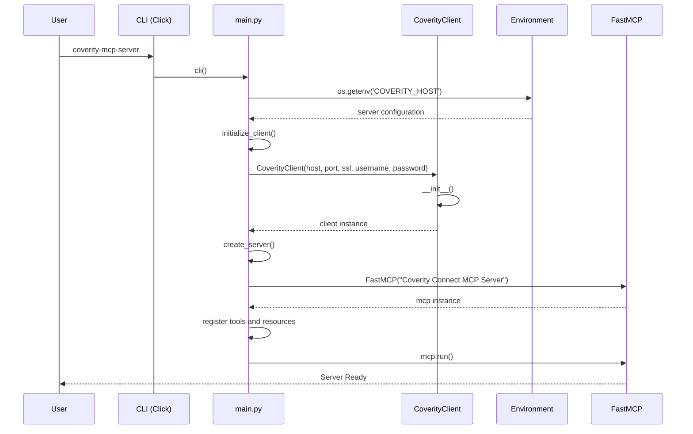
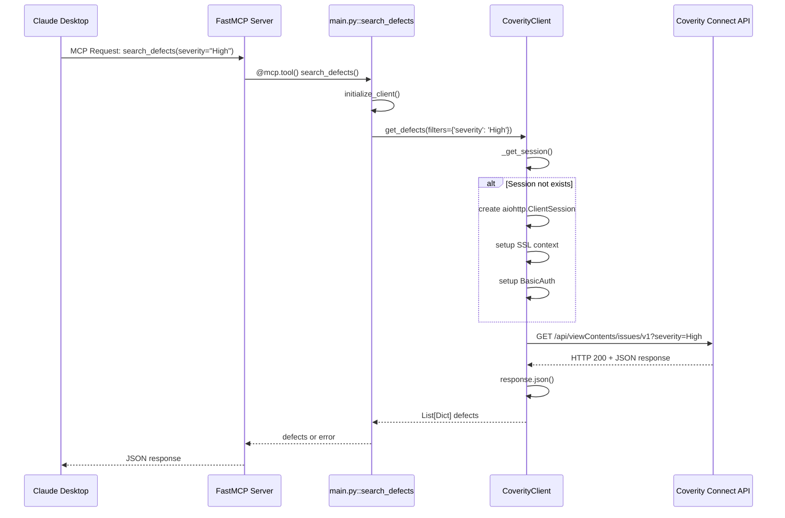
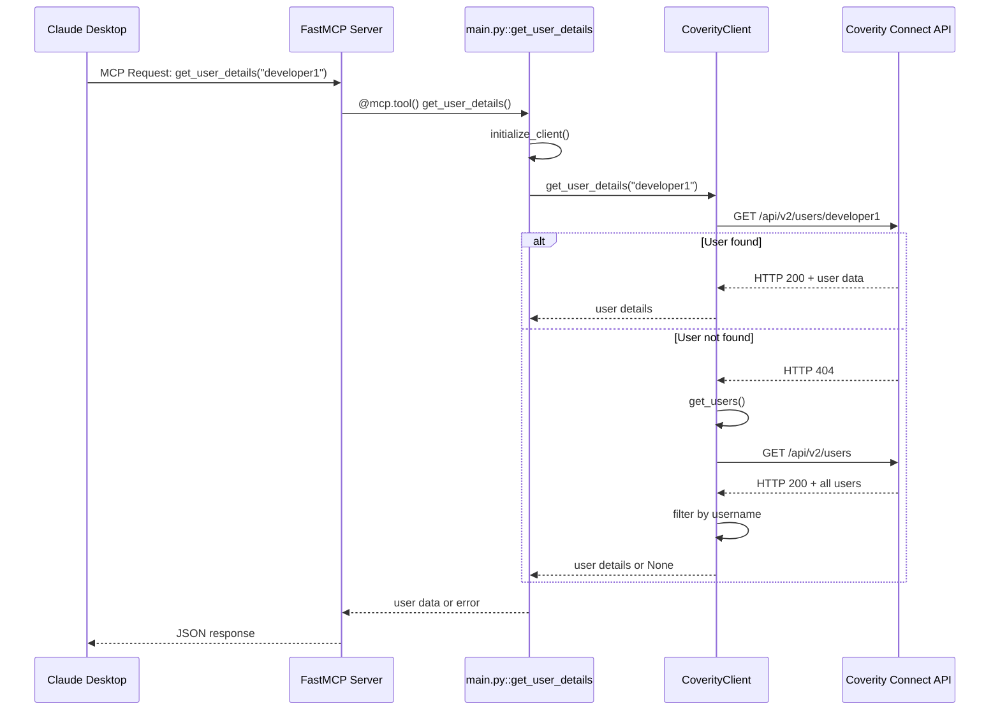
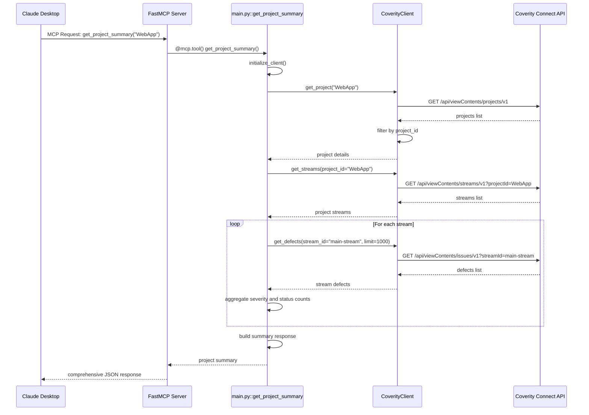
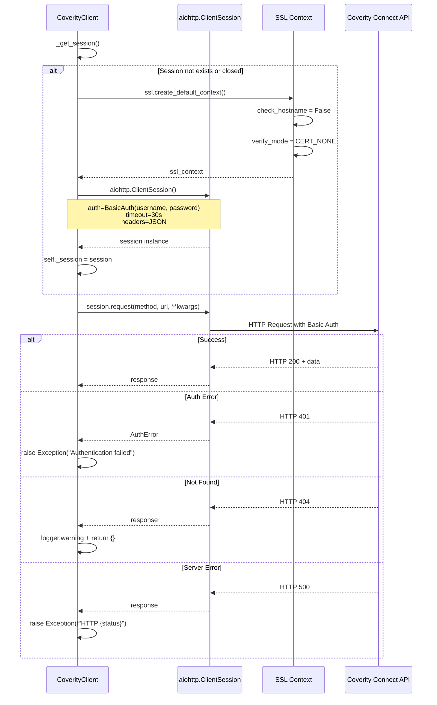
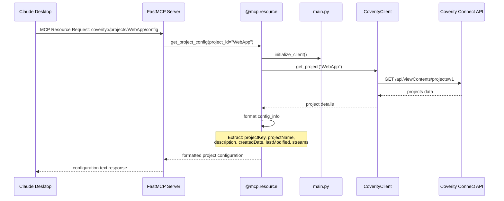
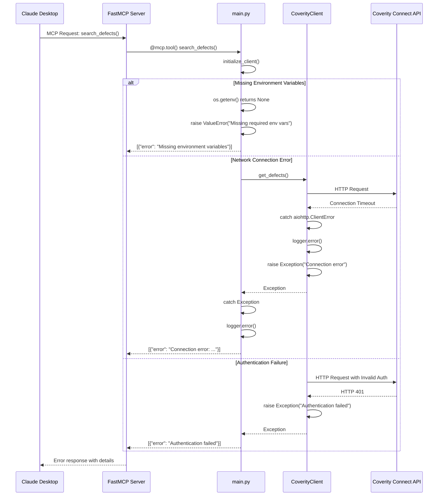
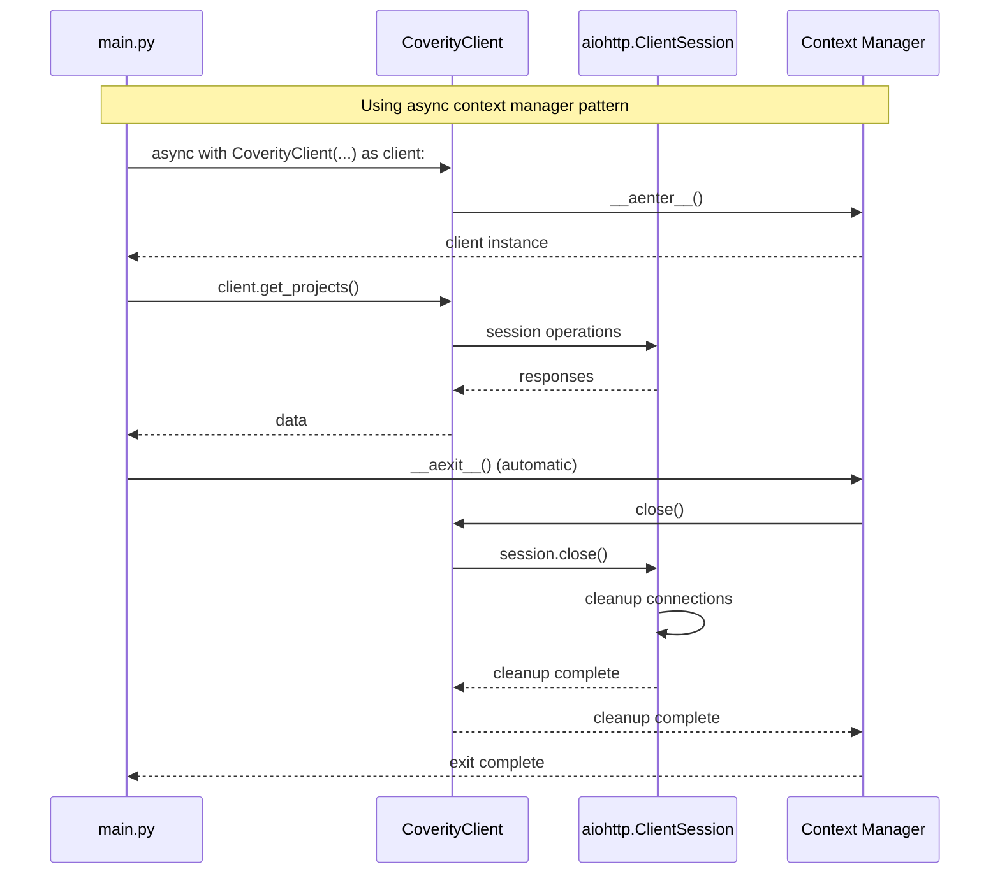
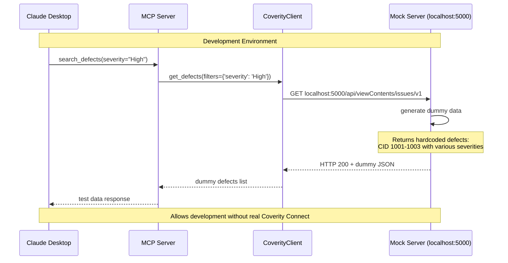
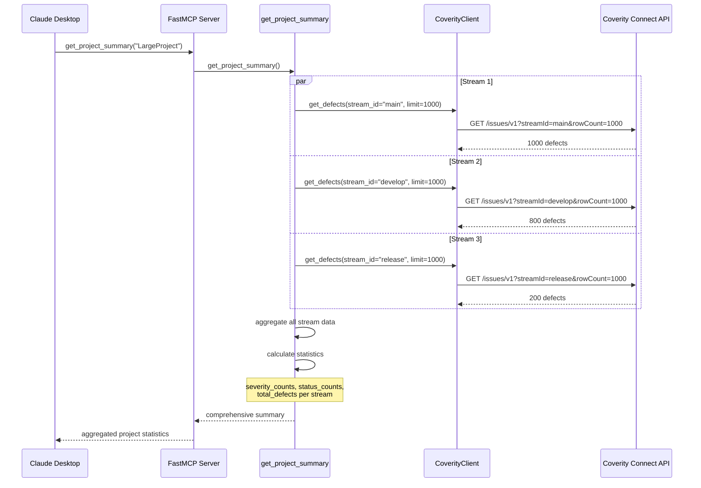

# Coverity Connect MCP Server - シーケンス図集

**Version**: 1.0.0  
**作成日**: 2025年7月21日  
**更新日**: 2025年7月21日

## 📋 概要

本ドキュメントでは、Coverity Connect MCP Serverの主要な処理フローをシーケンス図で表現します。

## 🔄 1. システム初期化シーケンス

## 🔍 2. 欠陥検索処理シーケンス

## 👥 3. ユーザー情報取得シーケンス

## 🏗️ 4. プロジェクトサマリー生成シーケンス

## 🔐 5. 認証・セッション管理シーケンス

## 📊 6. リソースアクセスシーケンス

## 🚨 7. エラーハンドリングシーケンス

## 🔄 8. セッション管理・クリーンアップシーケンス

## 🧪 9. 開発環境・Mock Serverシーケンス

## 📈 10. バッチ処理・大量データシーケンス

---

**これらのシーケンス図は、Coverity Connect MCP Serverの主要な処理フローを詳細に表現しています。システムの初期化から複雑なデータ集約処理まで、実装の動作を理解するための包括的なガイドとなります。**